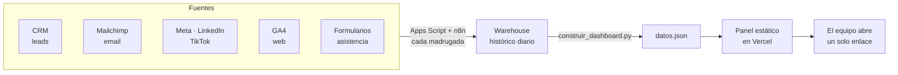
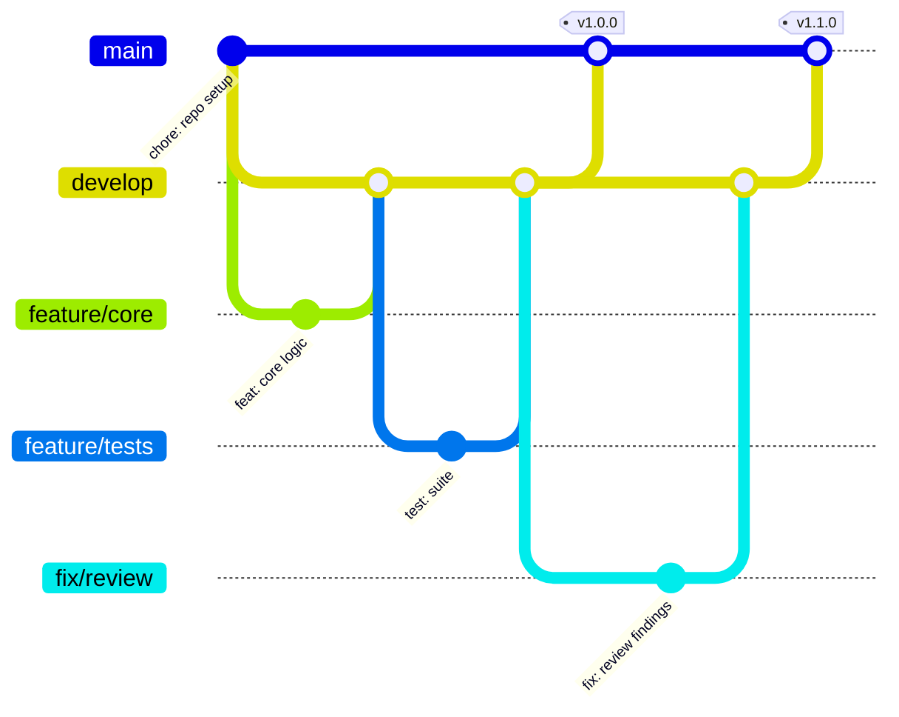

<h1 align="center">Panel de KPIs para una ONG</h1>

<p align="center"><i>Todas las métricas del programa en un enlace, sin servidor y sin dependencias</i></p>

<p align="center">
  
  
  
  
</p>

---

## Demo en video

<!-- ────────────────────────────────────────────────────────────────────
     ESPACIO RESERVADO PARA EL VIDEO

     Cuando lo tengas subido a YouTube (recomiendo "no listado"), reemplaza
     este bloque por la miniatura clickeable:

     [](https://youtu.be/TU_VIDEO_ID)

     Y borra el aviso de abajo.
     ──────────────────────────────────────────────────────────────────── -->

> *Video de la demo en camino.* Mientras tanto, el proyecto corre completo
> en local en menos de dos minutos siguiendo [Probarlo](#probarlo-en-2-minutos).

---

## El problema

Los números del programa vivían repartidos entre el CRM, Mailchimp, las redes, Google Analytics y las hojas de asistencia. Armar un reporte significaba abrir cinco pestañas y copiar a mano, así que se hacía tarde o simplemente no se hacía.

## Qué hace este proyecto

1. **Una sola pantalla** con captación, email, redes, web y gestión educativa.
2. **Se actualiza solo** cada madrugada, sin servidor que mantener.
3. **Detecta problemas**, no solo los muestra: si la apertura de email cae, lo dice y sugiere qué revisar.
4. **Cero dependencias**: los gráficos son SVG escrito a mano, así que no hay librerías que actualizar ni que se rompan.
5. **Accesible de verdad**: paleta validada para daltonismo, modo claro y oscuro, y una vista de tablas para que nada dependa solo del color.

---

## Cómo funciona



---

## Probarlo en 2 minutos

```bash
pip install pytest
python scripts/generar_warehouse.py     # 90 días de data ficticia
python scripts/construir_dashboard.py   # calcula KPIs → datos.json
python -m pytest -v                     # 26 tests
```

Para verlo, **abre `public/index.html` con doble clic** — funciona tal cual,
sin levantar servidor.

---

### Un tablero que solo dice "todo bien" no sirve

La data ficticia esconde **a propósito** un problema: la apertura de email viene cayendo. El panel lo detecta solo y muestra la alerta con la recomendación concreta.

También propone métricas que no estaban pedidas pero **cambian decisiones**: la conversión *por canal* (un canal puede traer muchos leads y convertir poco) y la asistencia real a talleres (inscribirse es gratis; asistir cuesta tiempo y transporte).

---

## Estructura

```
├── public/
│   ├── index.html          # el panel completo (HTML + CSS + SVG, sin librerías)
│   ├── datos.json          # generado; lo consume el panel
│   └── datos.js            # copia embebida para abrirlo sin servidor
├── src/kpis.py             # todas las fórmulas, una por métrica
├── warehouse/              # histórico por fuente
├── apps_script/            # extracción real programada
├── scripts/                # data ficticia y construcción del panel
└── tests/                  # 26 tests + prueba de gráficos vacíos
```

---

## Flujo de trabajo con Git

El repositorio sigue **Git Flow**: `main` siempre desplegable, `develop` como
integración, y una rama por cambio. Los merges son `--no-ff` para que cada
funcionalidad quede como un bloque legible en el historial, y cada versión
lleva su tag.



| Rama | Para qué |
| --- | --- |
| `main` | Solo versiones liberadas. Cada merge lleva su tag. |
| `develop` | Integración de todo lo terminado. |
| `feature/*` | Una funcionalidad nueva. |
| `fix/*` | Una corrección concreta. |
| `release/*` | Preparación de la versión, luego se fusiona a `main` y `develop`. |

Los mensajes siguen [Conventional Commits](https://www.conventionalcommits.org/):
`feat:`, `fix:`, `test:`, `docs:`, `chore:` — con el porqué del cambio en el
cuerpo, no solo el qué.

---

## Documentación

| Documento | Contenido |
| --- | --- |
| [`GUIA.md`](GUIA.md) | Guía técnica completa: arquitectura, decisiones, configuración y puesta en marcha |
| [`METRICAS.md`](METRICAS.md) | Diccionario de métricas: definición, fórmula, fuente, responsable y lo que deliberadamente no medimos |

---

## Licencia

[MIT](LICENSE) · Daniel Yataco Blas

> Proyecto de demostración construido con **datos ficticios**. No es un sistema
> en producción de ninguna organización.
