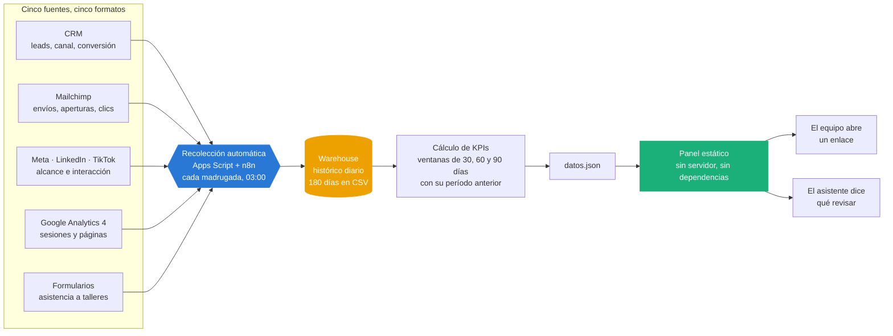
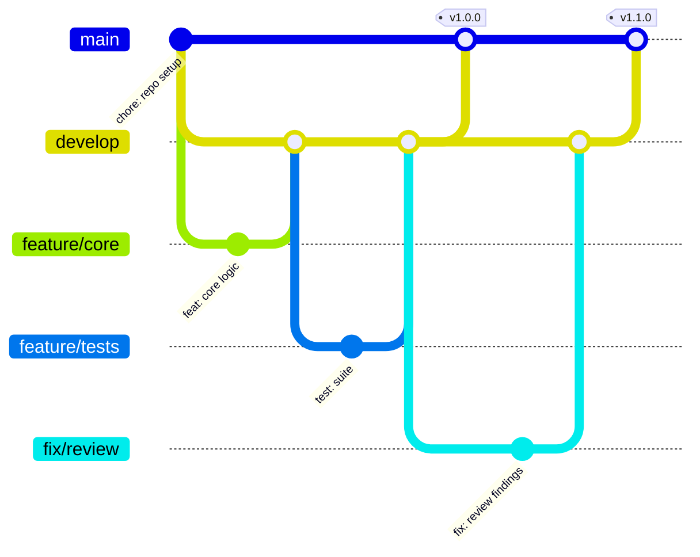

<h1 align="center">Panel de KPIs para una ONG</h1>

<p align="center"><i>Todas las métricas del programa en un enlace, sin servidor y sin dependencias</i></p>

<p align="center">
  
  
  
  
  
</p>

---

## Para qué existe este repositorio

Los números de un programa social viven repartidos: los leads en el CRM, las
campañas en Mailchimp, el alcance en las redes, las visitas en Analytics y la
asistencia en hojas de cálculo. Armar el reporte mensual significaba abrir cinco
pestañas y copiar a mano, y como costaba una mañana entera se hacía tarde o no
se hacía. Sin números, las decisiones se toman por intuición.

**Este proyecto convierte esas cinco fuentes en un solo enlace que se actualiza
solo cada madrugada, y que además señala qué hay que mirar.**



Las tres piezas que sostienen el diagrama:

| Pieza | Por qué está ahí |
| --- | --- |
| **Warehouse histórico** | Guardar solo el dato de hoy impide comparar. Se conservan 180 días porque una ventana de 90 necesita otros 90 detrás para que su variación signifique algo y no sea un artefacto de la falta de datos. |
| **Cálculo en Python, no en el navegador** | Cada ventana se calcula contra el warehouse con su propio período de comparación. Reescalar en el navegador daría números que parecen ciertos y no lo son. |
| **Panel estático** | Una organización sin equipo técnico no puede mantener un servidor ni actualizar librerías cada seis meses. Es un HTML que se despliega gratis. |

---

## Demo en video

<!-- ────────────────────────────────────────────────────────────────────
     ESPACIO RESERVADO PARA EL VIDEO

     Cuando lo tengas subido a YouTube (recomiendo "no listado"), reemplaza
     este bloque por la miniatura clickeable:

     [](https://youtu.be/TU_VIDEO_ID)

     Y borra el aviso de abajo.
     ──────────────────────────────────────────────────────────────────── -->

> *Video de la demo en camino.* Mientras tanto, el proyecto corre completo
> en local en menos de dos minutos siguiendo [Probarlo](#probarlo-en-2-minutos).

---

## Qué hace este proyecto

1. **Una sola pantalla** con captación, email, redes, web y gestión educativa.
2. **Se actualiza solo** cada madrugada, sin servidor que mantener.
3. **Detecta problemas**, no solo los muestra: si la apertura de email cae, lo dice y sugiere qué revisar.
4. **Cero dependencias**: los gráficos son SVG escrito a mano, así que no hay librerías que actualizar ni que se rompan.
5. **Accesible de verdad**: paleta validada para daltonismo, modo claro y oscuro, y una vista de tablas para que nada dependa solo del color.

---

## El tablero responde, no solo informa

Tres controles arriba y un asistente debajo de los indicadores:

- **Período (30 / 60 / 90 días).** No es un zoom en el navegador: cada ventana
  se calcula en Python contra el warehouse, con su propio período anterior para
  la comparación. Por eso el warehouse guarda 180 días — la ventana de 90
  necesita otros 90 detrás con que compararse.
- **Canales.** Apaga los que no interesan y los gráficos por canal, las tablas
  y el asistente se recalculan juntos.
- **Asistente de análisis.** Cuatro preguntas frecuentes; responde leyendo el
  período activo.

### Qué es exactamente el asistente

Un motor de reglas escritas a mano sobre los datos del período. Es
**determinista**: los mismos datos dan siempre el mismo texto. No llama a
ninguna API, así que el tablero desplegado no necesita credenciales, no tiene
coste por consulta y no puede inventarse una cifra.

Eso último importa más de lo que parece. Un modelo de lenguaje suelto sobre un
tablero de KPIs puede redactar mejor, pero también puede afirmar algo que los
datos no dicen; y aquí las afirmaciones mueven presupuesto. Las reglas son
auditables, y hay 15 tests que fijan datos conocidos y comprueban que las
conclusiones sean las correctas.

Conectarlo a un modelo real es sustituir una función — `responder()` — sin
tocar el resto del tablero. Está explicado en
[`METRICAS.md`](METRICAS.md) § Asistente.

### Qué encuentra

Con los datos de demostración, en la ventana de 30 días:

| Nivel | Hallazgo |
| --- | --- |
| Decidir | Web trae el 29 % de los leads y es el 4.º de 5 en conversión |
| Decidir | Las últimas 3 campañas de email abren al 24.7 % contra un 30.5 % del período |
| Vigilar | Podium convierte al 50 % y solo aporta el 16 % del volumen |
| Vigilar | 4 de cada 10 inscritos no llega al taller |
| Sostener | El alcance en redes sube un 44.6 % |

## Cómo funciona por dentro

El recorrido completo está en el diagrama de arriba. Estas son las piezas de código que lo ejecutan:

---

## Probarlo en 2 minutos

```bash
pip install pytest
python scripts/generar_warehouse.py     # 90 días de data ficticia
python scripts/construir_dashboard.py   # calcula KPIs → datos.json
python -m pytest -v                     # 26 tests
```

Para verlo, **abre `public/index.html` con doble clic** — funciona tal cual,
sin levantar servidor.

---

### Un tablero que solo dice "todo bien" no sirve

La data ficticia esconde **a propósito** un problema: la apertura de email viene cayendo. El panel lo detecta solo y muestra la alerta con la recomendación concreta.

También propone métricas que no estaban pedidas pero **cambian decisiones**: la conversión *por canal* (un canal puede traer muchos leads y convertir poco) y la asistencia real a talleres (inscribirse es gratis; asistir cuesta tiempo y transporte).

---

## Estructura

```
├── public/
│   ├── index.html          # el panel completo (HTML + CSS + SVG, sin librerías)
│   ├── datos.json          # generado; lo consume el panel
│   └── datos.js            # copia embebida para abrirlo sin servidor
├── src/kpis.py             # todas las fórmulas, una por métrica
├── warehouse/              # histórico por fuente
├── apps_script/            # extracción real programada
├── scripts/                # data ficticia y construcción del panel
└── tests/                  # 26 tests + prueba de gráficos vacíos
```

---

## Flujo de trabajo con Git

El repositorio sigue **Git Flow**: `main` siempre desplegable, `develop` como
integración, y una rama por cambio. Los merges son `--no-ff` para que cada
funcionalidad quede como un bloque legible en el historial, y cada versión
lleva su tag.



| Rama | Para qué |
| --- | --- |
| `main` | Solo versiones liberadas. Cada merge lleva su tag. |
| `develop` | Integración de todo lo terminado. |
| `feature/*` | Una funcionalidad nueva. |
| `fix/*` | Una corrección concreta. |
| `release/*` | Preparación de la versión, luego se fusiona a `main` y `develop`. |

Los mensajes siguen [Conventional Commits](https://www.conventionalcommits.org/):
`feat:`, `fix:`, `test:`, `docs:`, `chore:` — con el porqué del cambio en el
cuerpo, no solo el qué.

---

## Documentación

| Documento | Contenido |
| --- | --- |
| [`GUIA.md`](GUIA.md) | Guía técnica completa: arquitectura, decisiones, configuración y puesta en marcha |
| [`METRICAS.md`](METRICAS.md) | Diccionario de métricas: definición, fórmula, fuente, responsable y lo que deliberadamente no medimos |

---

## Licencia

[MIT](LICENSE) · Daniel Yataco Blas

> Proyecto de demostración construido con **datos ficticios**. No es un sistema
> en producción de ninguna organización.
